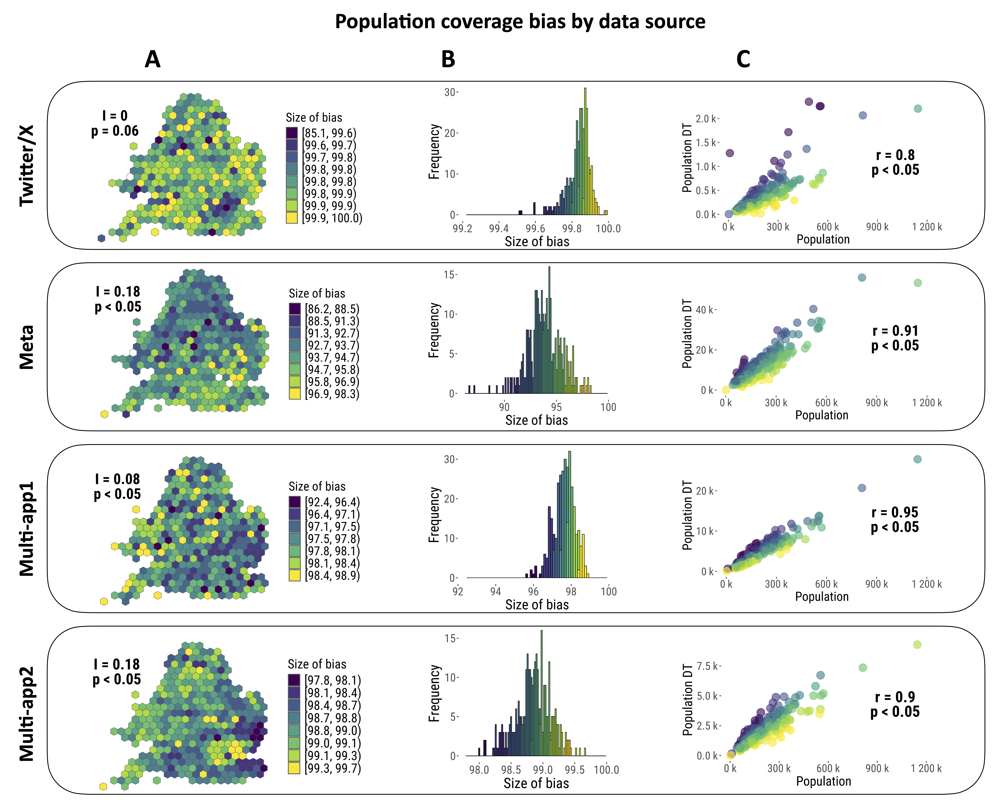

::: {.callout-note icon="false"}
The main document should include:

Title (no more than 150 characters)

Author names and affiliations, and ORCID iDs where available

Abstract (no more than 200 words). (This will be used in reviewer
invitation emails so please think about how to describe your work to
make it easy for a potential reviewer to determine whether they would be
suitable.)

All main manuscript text. Ensure that all figures, tables and any
relevant supplementary materials are mentioned within the text
References

Acknowledgements and funding statement (ensure that you have included
grant numbers and the names of any funding providers)

Tables with captions Figure captions with credits where relevant
:::

\newpage

# Introduction (FR)

<!-- CCA: PROPOSED PARAGRAPH STRUCTURE-->

<!-- P1: The emergence of Digital Footprint Data (DFD) has created new opportunities, particularly for research and policy - e.g. footfall, temporary changes in population, service demand, business. -->

<!-- P2: However, DFD is subject to biases that may compromise its representativity. Addressing these biases is critical because, if big data analyses rely on biased data, this can perpetuate social injustice and unfairly amplify socioeconomic disparities. -->

<!-- P3: Biases in DFD can arise from various sources. Here, we focus on coverage biases caused by access and use of digital technologies and representational biases, caused by the specific profiles of the people that tend to use those techonologies [specify sources such as demographic gaps, digital divides, or sampling limitations]. -->

<!-- P4: Efforts have been made to measure and explore the nature of biases across multiple data sources (brief literature review). -->

<!-- P5: However, we identify two main gaps. First, there is no standard approach for identifying or correcting biases in spatially and temporally aggregated DFD. Second, little work on the geographic variation of biases. Developing transparent, well-documented standards is essential, especially since most DFD sources are aggregated and, for privacy reasons, do not include user profile information. -->

<!-- P6: This paper aims to establish a framework to address this gap, contributing by proposing a standardised approach for identifying and measuring biases in DFD, as well as explaining the origin of these biases. -->

<!-- THE THREE PARAGRAPHS BELOW WERE WRITTEN BY FR -->

<!--  The rapid growth in mobile phone penetration globally has created new opportunities for research, policy and decision making. Though the collection of call records, data streams, Mobile phones record highly precise and frequent location information in real time. As such, -->

<!-- Location data extracted from mobile phones represent a great resource to understand the spatio-temporal patterns of human mobility; that is, how and where people move. However, differences in the access and use of digital technology, such as smartphone applications across the population create biases leading to variations in the statistical representation of population groups in the resulting datasets. These biases have represented a major obstacle, leading to skepticism and deterring widespread use of these data. Work has made some progress on addressing biases for data capturing basic population attributes, such as sex and age. Less has been done at addressing biases for data which do not disclose population attributes. This paper provides a general overview of existing biases and state-of-the-art approaches, and discusses potential avenues for future research. -->

<!-- Focus on aggregated data to ensure privacy and confidentiality -->

Traditional data streams, such as the census and surveys have been the
primary official source to provide a comprehensive representation of
national populations in countries worldwide. However, fast-paced
societal changes and emergency disasters, such as climate-induced
hazards and COVID-19 have tested and accentuated weaknesses in
traditional data systems [@green2021]. Traditional data systems often
provide data in infrequent and coarse temporal and geographical
resolutions [@rowe23-bigdata]. Generally they are expensive to maintain
and operate, and are slow taking months or years since they data are
collected to their release [@rowe23-bigdata]. Data collection from
climate- or conflict-impacted areas is generally unfeasible because of
restrictions due to high levels of insecurity and risk
[@iradukunda2025]. Yet, fast-paced societal changes require high
frequency, granular and up-to-date information to support real-time
planning, policy and decision making.

At the same time, we have seen the confluence of two diverging trends in
data availability. On the one hand, growing evidence of declining survey
response rates across many countries over the last 20 years is
accumulating **[REF]**. Dwindling numbers in surveys can represent
distorted picture of society **[REF]**. On the other hand, significant
advances in sensor technology, computational power, storage and digital
network platforms have unleashed a data revolution producing large
trails of digital trace data **[REF]**. These data are now routinely
collected and stored. They offer spatially granular, frequent and
instant information to capture and understand human activities at
unprecedentedly high resolution and scale, with the potential to produce
real-time actionable intelligence to support decision making **[REF]**.
Hence, national statistical offices are actively seeking to integrate
these data into their national data infrastructure **[REF]**.

Mobile phone data (MPD) collected via GPS- and IP-based technology have
become a prominent source of nontraditional data to monitor population
changes. Increasing usage of mobile services on smartphones and wearable
devices have resulted in the generation of large volumes of geospatial
data, offering novel opportunities to advance understanding of spatial
human behaviour, and thus revolutionise research, business and
government decision making and practices [@rowe23-bigdata]. MPD are now
a core component of the digital economy, creating new market
opportunities for data intelligence businesses, such as Cuebiq/Spectus,
Safegraph and Locomizer. They have been used to create critical evidence
to support policy making, prominently during the COVID-19 pandemic. In
research, MPD have been used to develop innovative approach to infer
mode of transport [REF], monitor footfall changes [REF], profile daily
mobility signatures [REF], sense land use patterns [REF], predict
socioeconomic levels [REF], define urban extents [REF], quantify tourism
activity [REF] and estimate migration and population displacement [REF].

However, the use of MPD present major epistemological, methodological
and ethical challenges [@rowe23-bigdata]. A key unresolved challenge is
potential biases in MPAD compromising their statistical
representativeness and perpetuate social injustice [REF]. Biases reflect
societal digital and socioeconomic inequalities. Biases emerge from
differences in the access and use of the mobile phone applications used
to collect MPD [@wesolowski13-biases]. Only a fraction of the population
in a geographical area owns a smartphone, and even an smaller share
actively uses a specific mobile phone app. In the UK, for example, 98%
of the adult population have a mobile phone and 92% of this population
use a smartphone [@ofcom23], but a smaller percentage actively use
Facebook (70%) or Twitter (23%) [@statista24]. Additionally, biases
emerge from differences in the access and use of digital technology
across population subgroups reflecting socioeconomic and demographic
disparities. For instance, wealthy, young and urban populations
generally have greater access and more intensively use of mobile phone
applications, and therefore tend to be over-represented in MPD [REF].

The use of biased MPD can thus have major practical and societal
implications. If used uncorrected, MPD reproduce selective patterns of
smartphone ownership and application usage, rendering inaccurate or
distorted representations of human population activity. Such
representations disproportionately reflect behaviours of younger, urban
and higher-income users while underrepresenting marginalised or
less-connected groups. Distorted representations based on biased MPD can
thus misguide decision making, policy and planning interventions, and
thus amplify existing socio-economic disparities. In practice, existing
applications of MPD often use uncorrected population statistics derived
from MPD and have thus been constrained to offer a partial picture for a
limited segment of the overall population. Such data can only afford to
provide rough signals about the spatial distribution of (e.g. spatial
concentration), trends (e.g. increasing) and changes (e.g. low to high)
in populations [@rowe22-sensing-ukraine]. They have cannot provide a
full representation of the overall population.

Efforts have been made to measure and assess biases in aggregate
population counts from digital data sources. Existing analyses typically
measure the extent of bias measuring the system-wide difference in the
representation of population counts from digital platforms and censuses.
To estimate the representation of digital data sources, the penetration
rate is computed as the active user base of a digital platform over the
census resident population. Existing analyses have thus been able to
established systematic gender, age and socio-economic biases in
population data obtained via API (or Application Programming Interface)
from social media platforms, such as Facebook and Twitter/X. However,
this approach requires information on the demographic and socio-economic
attributes of the collected sample and has focused on estimating biases
at the country level. Yet, these attributes are rarely available from
mobile phone network operators. In practice, they are generally
unavailable for MPD, and biases may vary widely across subnational
areas. What is missing is an systematic approach to measure biases in
population counts from digital platforms, when population attributes are
unknown, and quantify the geographic variability in the extent of biases
in these data.

To address this gap, this paper aims to establish a standardised
approach to empirically measure the extent of biases in population data
derived from digital platforms, and identify their key underlying
contextual factors across subnational areas. We seek to address the
following research questions:

-   What is the comparative extent of population coverage of digital
    sources relative to widely-used traditional surveys?
-   How systematic is the association between larger biases and the
    over-representation of rural, more deprived, child and elderly
    populations?
-   To what extent, are population data assembled from multiple
    applications versus single applications associated with lower bias?

Our approach proposes a statistical indicator of population coverage to
measure the extent of bias, and uses explainable machine learning to
identify key contextual factors contributing to spatial variations in
the extent of bias. Biases in digital trace data can emerge from
multiple sources, such as algorithmic changes, device duplication and
geographic location accuracy [REF]. We do not intend to identify these
individual sources of error. We focus on quantifying the extent of
\`\`cumulative'' bias; that is, the resulting bias from the accumulation
of these error sources. We use data collected from single and multiple
mobile phone apps, and compare their results. As outlined above, we test
the extent to which biases can be mitigated by leveraging information
from multiple apps encompassing a more diverse user population.
Specifically, we use two single-app (i.e. Facebook and Twitter/X) and
two multi-app providers (i.e. Locomizer and a European provider). We
focus on the use of aggregated population counts as this has become a
common ethical and privacy-preserving practice for companies to provide
access to highly sensitive data for social good.

Our study makes two key contributions. \* Methodological contribution
i.e. what we hope to achieve with our approach / quality assessment
framework ideas + start setting standards of good practice in the use of
MPD.\
\* Substantive contribution - systematic evidence identifying key
predictor of biases + do we find evidence of lower biases / greater
population coverage for multi-app better than single app?

<!-- Structure: do we need this? -->

# Data and methods

```{=html}
<!-- NOTE: I think that we need a paragraph describing and providing an
overview of the methodological strategy, including both data and
methods. Two points are particularly crucial to connect: (1) The use of
data from March 2021 for our assessment against census data; and (2) the
use of multiple data sources. We need to describe the idea of single-
and multiple-sourced app data. I wonder if we should include a table
listing their general attributes: advantages and limitations in terms of
their temporal and spatial coverage and resolution. This may not be the
place for the table but would be good to consider for the book if we
compared GPS data to other sources. !--->
```

<!-- Start with overview of dta and methods. Include here a figure of overview of data+methods (see slides for 1st advisory board meeting. Need to alter figure to differentiate between single source data and multi-source (multi-app) data !-->

We propose a systematic framework to measure and explain biases in population count data derived from multiple mobile phone apps. We use datasets collected in or around March 2021 to align as closely as possible with the dates of the most recent census in the area of study, hence enabling direct and temporally consistent comparisons. The datasets represent both single-app sources (Meta and Twitter/X) and multi-app sources (Locomizer and a European provider), with diverse user groups and data generation mechanisms. These differences allow us to examine how data source characteristics influence population coverage and representativeness. We focus on aggregated population counts, which are commonly used in mobility research, as a privacy-preserving and ethically responsible data format. Our methodological approach focuses on two types of biases: coverage bias, referring to the share of the population captured by each dataset; and representational bias, which reflects how well the demographic and socioeconomic composition of the digital sample aligns with that of the general population. The analysis involves three stages. In the first stage, we propose a metric of population coverage bias, and compare this across the digital data sources as well as with other widely used national surveys. In the second stage, we compute population coverage bias across subnational areas, and analyse the patterns of spatial variability. In the third stage, we model the spatial variability using demographic and socioeconomic covariates to understand which contextual factors contribute to representational bias. Figure 1 provides an overview of the methodological workflow, which includes data acquisition, bias measurement, spatial analysis of bias and bias explanation.

## Data (CC)

<!-- A table describing key attributes of the data would be handy here, such as the number of unique devices, form of data collection, spatial resolution and temporal granularity. For the multi-app data, please include the number or type of apps used to collect the information. -->

To evaluate the extent of bias in digital population data, we assemble and compare four datasets representing both single- and multi-app data sources. Particularly, data from Meta-Facebook and Twitter/X represent single-app platforms, while Multi-app Source 1 and Multi-app Source 2 aggregate data from multiple mobile phone apps. Table 1 summarises the main characteristics of each dataset, including the source type, form of data collections, temporal granularity, temporal coverage, spatial resolution, access method and data acquisition cost. The following subsections describe each data source in detail.

While Twitter/X is not exclusively accessed via mobile devices and its location data are not always collected via GPS, it has nonetheless been widely used in population and mobility research for its ability to capture patterns at high spatio-temporal resolution and across broad geographic areas. Additionally, the Twitter Academic API is no longer available for free data collection, limiting access to new data. Despite these limitations, we include Twitter/X in our analysis as a representative single-application data source. Archived datasets, such as the one used in this study or the Harvard Geotweet Archive (https://gis.harvard.edu/data) continue to support population and mobility research.


{width="500" height="190"}

### Meta

We use the Facebook Population dataset created by Meta and accessed
through their Data for Good Initiative
(<https://dataforgood.facebook.com>). This consists of anonymised aggregate location data from Facebook app users in the UK, who
have the location services setting activated on their smartphone. We selected data entries covering March 2021, the month when the most recent UK Census was carried
out. Prior to releasing the datasets,
Meta ensures privacy and anonymity by removing personal information and
applying privacy-preserving techniques, including small-count dropping for population counts under 10, addition of random noise and spatial smoothing using inverse distance-weighted
averaging [@maas2019]. 

The dataset includes the number of
active Facebook app users, aggregated into three daily 8-hour time windows (i.e.
00:00-08:00, 08:00-16:00 and 16:00- 00:00). To approximate the resident population, we focus on the time window corresponding to nighttime hours (00:00–08:00), when users are more likely to be at home. For the study area, this time window yields an average of 4.2 million daily user records. Spatially, the Facebook Population data is aggregated according to the Bing Maps Tile System [@bingmaps_tile_system]. In this study, we use data aggregated at Bing tile level 13, which corresponds to a spatial resolution of approximately 4.9 $\times$ 4.9 km at the Equator [@maas2019].

To enable comparison with UK census data, we process the Facebook Population data by averaging daily values over March 2021 and aggregating them to the level of Local Authority Districts (LADs). This harmonisation ensures temporal and spatial alignment with official census boundaries. In the Supplementary Information, we test alternative processing strategies, including averaging over a single week in March and reversing the order of spatial and temporal aggregation. These sensitivity checks confirm that our main findings are robust to variations in the data processing workflow.

### Twitter

<!-- Argue better why Twitter data also falls in the umbrella of GPS data. Some entries are from GPS (geotagged posts) but we are also including others, like those geolocated from IP addresses !-->

We use an anonymised, analysis-ready dataset of active
X (previously Twitter) users in the UK, originally collected via the Twitter Academic API. The data consists of monthly counts of active users, spatially aggregated across the UK, and is openly available at <https://github.com/c-zhong-ucl-ac-uk/Twitter-Internal-Migration>. Geolocation is obtained either directly from geotagged tweets or through manual geocoding using bounding boxes provided by the API, based on the IP address of the posting device (for methodological details, see [@wang2022]). The full dataset includes approximately 161 million tweets from
February 2019 to December 2021. For this study, we restrict the analysis to March 2021 to align with the timing of the 2021 UK Census, during which 125,637 user home locations were identified. Home locations are assigned to Local Authority Districts (LADs) using a frequency-based detection algorithm, further described in [@wang2022].

### Multi-app Source 1

We sourced data from a location analytics company that collects GPS data from approximately 26% of smartphones in the UK. The raw data consist of anonymised device-level GPS traces collected via a range of smartphone applications, where users have explicitly granted location-sharing permissions. The dataset spans a 7-day period corresponding to the first week of April 2021 and includes 443,553,155 GPS records. Although the dataset does not perfectly align with the official 2021 UK Census date, the temporal proximity ensures a high degree of comparability.

To infer the place of residence of users, we apply a commonly used rule-based classification method, following approaches outlined in [@wang2022; @zhong24working]. Specifically, the place of residence associated with a device is defined as the location with the highest number of GPS records recorded during nighttime hours (10 PM–6 AM). To be classified as a residence, a location must account for more than 50% of the device nighttime records. Furthermore, the number of nighttime records during the observation period must be at least 2. For comparability across data sources, all identified residence locations are aggregated to the level of Local Authority Districts (LADs). Using this method, we detect 1,536,922 home locations.

### Multi-app Source 2

Our analysis includes a second source of analysis-ready location
data, which is openly-available on GitHub
([https://t.ly/dzlzB)](https://t.ly/dzlzB)). This dataset has already
been processed to identify the home location of users according to the
methodology described in [@zhong24working]. The raw data is collected by
a UK-based data service company, which licenses mobile GPS data from 200
smartphone apps and applies pre-processing methods to ensure user
privacy and anonymity. The dataset covers the entire UK for November 2021 and includes inferred home and work locations for 630,946 users.

While this period does not exactly coincide with the 2021 UK Census, the
difference of less than a year is considered sufficiently close for our
analysis. To ensure consistency across datasets, we further process the data by aggregating it spatially from the Middle Layer Super Output Area (MSOA) level to the Local Authority District Level (LAD).

### Other data

In addition to the mobile phone app data sources described above, we use resident population counts from the 2021 UK Census, aggregated at the LAD level. These counts serve as the ground truth reference for comparing population estimates derived from each digital dataset. We also draw on a set of area-based covariates from the census, covering demographic, socioeconomic, and housing characteristics, along with the geographic coordinates of each LAD centroid. These variables are used to investigate and explain the contextual factors most strongly associated with the magnitude and spatial variation of bias in the digital trace data. The full list of covariates is provided in Table 2.

{width="450" height="460"}


## Methods

Our proposed methodology consists of two stages aimed at quantifying two
types of biases: coverage biases and representational biases. Coverage
biases relate to the sample size of the dataset and refer to the
proportion of the population covered in the dataset. Representational
biases, arise from the demographic and socioeconomic characteristics of
the users who generate the digital trace data through specific
technologies.

The first stage of our methodology seeks to quantify coverage biases by
examining the variations in coverage across different spatial units. We
leverage the spatial granularity of digital trace data to analyse
coverage biases at more localised spatial scales. This allows us to
identify the extent to which different regions are represented within
the datasets, revealing any potential underrepresentation or
overrepresentation in specific locations.

The second stage seeks to quantify representational biases. To do this,
we leverage the spatial heterogeneity of coverage biases and model this
variation in terms of demographic and socioeconomic variables that
characterise local populations. This analysis allows us to identify
which specific demogrpahic and socioeconomic population attributes, such
as average income, education level or age composition, are more likely
to be associated with higher values of coverage bias, thus highlighting
which population groups tend to be underrepresented in different sources
of digital trace data.

### Measuring coverage bias (CCA)

We define a metric to quantify the magnitude of coverage bias in each
subnational area. This metric is based on the population coverage of the
dataset, which we compute as the ratio of the population captured
(sample size) by dataset $D$, denoted as $P_i^D$, to the total local
population of an area, $P_i$. Formally, the coverage $c_i$ is given by:
\begin{equation}
c_i = \dfrac{P_i^D}{P_i} \times 100,
\end{equation} where $D$ identifies a given dataset, and $i$ denotes
each subnational area. The resulting ratio $c_i$ is assumed to take
values between $0$ and $100$, with 100 representing full population
coverage. If users have multiple accounts, the ratio can exceed $100$,
since the total sample size could be greater than the local population
of area $i$.

We then define the size of bias $e_i$ as:

```{=tex}
\begin{equation} \label{eq:size-bias}
e_i = 100 - c_i
\end{equation}
```
In this case, a value of $e_i = 0$ indicates a lack of coverage bias,
which corresponds to full population coverage ($c_i = 100$). We use this
bias indicator to analysis the magnitude and spatial distribution of
coverage bias across multiple sources of digital trace data.

### Identifying the key predictors of bias (FR)

We seek to understand the association between the size of bias and
area-level demographic and socioeconomic attributes. To what extent
different demographic and socioeconomic groups are represented in DFD?
And how do these vary geographically and across digital platform? We
will assess these questions by measuring the area-level association
between our coverage indicator and key demographic and socioeconomic
attributes. We will use a random forest to model our coverage indicator
as a function of demographic and socioeconomic attributes. The outcomes
will identify the most important area-level demographic and
socioeconomic features to predict the coverage bias of a given digital
technology. We will use this information to inform our models in WP-II.

eXtreme Gradient Boosting (XGBoost) is an efficient and scalable
implementation of gradient boosting framework by [@friedman2001;
@friedman2000].

# Results

## Varying extent of bias across data sources

As digital trace data becomes increasingly accessible, it opens up new
avenues for studying human behaviours with remarkable temporal and
spatial precision, extensive geographic coverage, and near real-time
access. However, the potential presence of biases can undermine the
validity of the data to deliver statistically representative evidence.

In this section, we focus on quantifying the biases in multiple sources
of digital trace data that arise due to the extent of population
coverage, i.e. the proportion of the total population captured in the
dataset. In Figure , we contextualise these findings by comparing them
with various traditional datasets, particularly key UK surveys available
through the UK Data Service [@ukdataserviceSurveysData]. On the
$x$-axis, we represent two variables: at the top, the sample size of the
dataset, expressed as the number of respondents or subjects per 1,000
people, which reflects the population coverage of the dataset; and at
the bottom, a measure of bias in terms of this coverage, as defined in
equation \ref{eq:size-bias}. The figure highlights the remarkable
ability of digital trace data to capture a larger share of the total
population compared to traditional surveys, thanks to the automated,
passive nature of data collection on digital platforms. This contrasts
with the manual recruitment and data collection processes required for
surveys. As a result, the size of bias is generally lower for digital
trace data, highlighting its potential to inform comprehensive empirical
analyses.

<!-- Add no. of responses in legend (black dot) !-->

{#fig:survey width="500" height="300"}

While the findings in Figure \ref{fig:survey} demonstrate the potential
of digital trace data compared to traditional data sources, high
population coverage alone does not ensure the data is representative of
different population groups.

In surveys, specific strategies are usually implemented during the data
generation process to improve the statistical representativeness of the
sample. For example, sampling techniques such as stratified sampling or
cluster sampling can be applied so that the sample reflects the broader
population of interest. After sampling, if certain groups remain
under-represented, responses can be adjusted using post-stratification
techniques. However, even when these strategies are applied, there is no
guarantee that the survey will be fully representative of the broader
population of interest [@cochran1977sampling]. This is because
representativeness can only be achieved with respect to a finite set of
attributes (e.g. age, gender, income levels, location, etc.). Ensuring
perfect representativeness would only be possible either by surveying
the whole population.

With digital trace data, achieving statistical representativeness is
even more challenging. Unlike survey data, which is actively collected
using structured sampling methods, digital trace data is generated
passively as a byproduct of online interactions, transactions, or device
usage, without any control over who is included in the dataset.
Furthermore, by the time this data reaches researchers or analysts, it
is often anonymised, and does not contain demographic identifiers. As a
result, it is not possible to apply the standard post-stratification
weighting techniques that are typically used to adjust survey or census
data for improved representativeness.

We argue that, even though we do not always have specific demographic
information of the individuals captured through digital trace data, we
can infer some of these characteristics by leveraging the
spatio-temporal granularity of digital trace data. We argue that this is
a necessary first step to understand which population groups might be
under or over-represented in different sources of digital trace data.
This information is necessary to later adjust the data so that it is
more representative of the population of interest.

## The spatial distribution of biases (CC)

Next, we take advantage of the detailed geographic information in the
digital trace data to analyse bias at smaller, more localised spatial
levels. This helps us understand how well different geographic areas are
represented in the datasets. Since local populations vary in their
socioeconomic characteristics, we can use the degree of bias at these
smaller scales in the next step of our analysis, to determine which
population attributes are most associated with underrepresentation in
the data.

Figure \ref{fig:size-bias-spatial} shows the geographic variation of the
size of bias at the Local Authority District (LAD) level. Each row in
the figure corresponds to each of the digital trace datasets analysed
here. Within each row, we include: i) an hexagonal cartogram for the
size of bias in each LAD, representing the LADs as hexagons of equal
size to simplify the visualisation while maintaining relative positions;
with this cartogram, we report Moran's I as a measure of spatial
autocorrelation and its associated p-value, ii) a histogram of the size
of bias, showing the distribution of values across LADs, iii) a scatter
plot of the population covered by the digital trace data vs. the actual
population of each LAD; with the scatter plot, we include the Pearson
correlation coefficient and its associated p-value.

{#fig:size-bias-spatial width="533"
height="418"}

Examining the spatial variation in bias size, we observe distinct
patterns across the DT datasets considered. These varied spatial
patterns likely stem from differences in the demographic composition of
users for each technology. Factors such as age, socioeconomic status,
digital literacy, and regional preferences for certain platforms or
devices may contribute to these variations. Bias tends to display
stronger spatial patterns for Meta data and the second source of
multi-app GPS data, with lower bias in the North of England and Wales.
In contrast, Twitter/X data and the first souce of multi-app GPS data
follow more mixed patterns, as demonstrated by the values of Moran's I
closer to zero. Twitter/X data generally exhibits high bias, except in
London, the South East, and a few isolated areas. Similarly, bias in
first source of multi-app data tends to be lower in the South and South
East.

Turning to the histograms, we observe that bias size is highest for
Twitter/X data, with all values exceeding 99.5 except for a single
outlier, the City of London. This outlier likely arises due to the
unique demographic and occupational characteristics of the area. While
relatively few people reside in the City of London, it hosts a large
number of workers, including temporary professionals, who may be staying
in hotels. The home-detection algorithm in [@wang2022] used to generate
the Twitter/X data used here might classify the workplace or temporary
accommodations of City of London workers as their primary residences,
leading to an anomalously low bias measurement. Following Twitter/X, the
second source of multi-app GPS data exhibits the next highest bias
values. In contrast, the first source of multi-app data shows lower
bias, while Meta data has the lowest overall bias. Notably, Meta data
also displays the widest distribution of bias values, indicating greater
variability across different locations.

The scatter plots show a high linear correlation between the population
covered by the digital trace data and the actual population of each LAD,
as demonstrated by the Pearson coefficient, all above 0.8. This suggests
that, on average, the actual population in the LADs is not an indicator
of the size of bias in DT data, as the population coverage $c_i$ remains
the consistent regardless of $P_i$ . This could be a result of the fact
that the biases in the data are not driven by the number of people, but
rather by other their demographic characteristics such as age, income or
educational level. In the next section, we explore the variability of
demographic attributes of local populations as possible determinants of
the size of bias.

## Explaining biases (FR)

# Discussion (FR)

# Conclusion (CC)

# References
