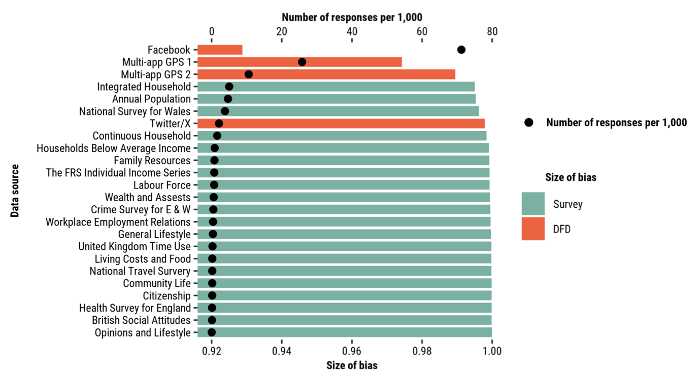

\newpage

# Introduction

<!-- PROPOSED PARAGRAPH STRUCTURE-->

<!-- P1: The emergence of Digital Footprint Data (DFD) has created new opportunities, particularly for research and policy - e.g. footfall, temporary changes in population, service demand, business. -->

<!-- P2: However, DFD is subject to biases that may compromise its representativity. Addressing these biases is critical because, if big data analyses rely on biased data, this can perpetuate social injustice and unfairly amplify socioeconomic disparities. -->

<!-- P3: Biases in DFD can arise from various sources. Here, we focus on coverage biases caused by access and use of digital technologies and representational biases, caused by the specific profiles of the people that tend to use those techonologies [specify sources such as demographic gaps, digital divides, or sampling limitations]. -->

<!-- P4: Efforts have been made to measure and explore the nature of biases across multiple data sources (brief literature review). -->

<!-- P5: However, we identify two main gaps. First, there is no standard approach for identifying or correcting biases in spatially and temporally aggregated DFD. Second, little work on the geographic variation of biases. Developing transparent, well-documented standards is essential, especially since most DFD sources are aggregated and, for privacy reasons, do not include user profile information. -->

<!-- P6: This paper aims to establish a framework to address this gap, contributing by proposing a standardised approach for identifying and measuring biases in DFD, as well as explaining the origin of these biases. -->

<!-- THE THREE PARAGRAPHS BELOW WERE WRITTEN BY FR -->

<!--  The rapid growth in mobile phone penetration globally has created new opportunities for research, policy and decision making. Though the collection of call records, data streams, Mobile phones record highly precise and frequent location information in real time. As such, -->

<!-- Location data extracted from mobile phones represent a great resource to understand the spatio-temporal patterns of human mobility; that is, how and where people move. However, differences in the access and use of digital technology, such as smartphone applications across the population create biases leading to variations in the statistical representation of population groups in the resulting datasets. These biases have represented a major obstacle, leading to skepticism and deterring widespread use of these data. Work has made some progress on addressing biases for data capturing basic population attributes, such as sex and age. Less has been done at addressing biases for data which do not disclose population attributes. This paper provides a general overview of existing biases and state-of-the-art approaches, and discusses potential avenues for future research. -->

<!-- Focus on aggregated data to ensure privacy and confidentiality -->

Traditional data streams, such as the census and surveys have been the
primary official source to provide a comprehensive representation of
national populations in countries worldwide. However, fast-paced
societal changes and emergency disasters, such as climate-induced
hazards and COVID-19 have tested and accentuated weaknesses in
traditional data systems [@green2021]. Traditional data systems often
provide data in infrequent and coarse temporal and geographical
resolutions [@rowe23-bigdata]. Generally they are expensive to maintain
and operate, and are slow taking months or years since they data are
collected to their release [@rowe23-bigdata]. Data collection from
climate- or conflict-impacted areas is generally unfeasible because of
restrictions due to high levels of insecurity and risk
[@iradukunda2025]. Yet, fast-paced societal changes require high
frequency, granular and up-to-date information to support real-time
planning, policy and decision making.

At the same time, we have seen the confluence of two diverging trends in
data availability. On the one hand, growing evidence of declining survey
response rates across many countries over the last 20 years is
accumulating **[REF]**. Dwindling numbers in surveys can represent
distorted picture of society **[REF]**. On the other hand, significant
advances in sensor technology, computational power, storage and digital
network platforms have unleashed a data revolution producing large
trails of digital trace data **[REF]**. These data are now routinely
collected and stored. They offer spatially granular, frequent and
instant information to capture and understand human activities at
unprecedentedly high resolution and scale, with the potential to produce
real-time actionable intelligence to support decision making **[REF]**.
Hence, national statistical offices are actively seeking to integrate
these data into their national data infrastructure **[REF]**.

Mobile phone data (MPD) collected via GPS- and IP-based technology have
become a prominent source of nontraditional data to monitor population
changes. Increasing usage of mobile services on smartphones and wearable
devices have resulted in the generation of large volumes of geospatial
data, offering novel opportunities to advance understanding of spatial
human behaviour, and thus revolutionise research, business and
government decision making and practices [@rowe23-bigdata]. MPD are now
a core component of the digital economy, creating new market
opportunities for data intelligence businesses, such as Cuebiq/Spectus,
Safegraph and Locomizer. They have been used to create critical evidence
to support policy making, prominently during the COVID-19 pandemic. In
research, MPD have been used to develop innovative approach to infer
mode of transport [REF], monitor footfall changes [REF], profile daily
mobility signatures [REF], sense land use patterns [REF], predict
socioeconomic levels [REF], define urban extents [REF], quantify tourism
activity [REF] and estimate migration and population displacement [REF].

However, the use of MPD present major epistemological, methodological
and ethical challenges [@rowe23-bigdata]. A key unresolved challenge is
potential biases in MPD compromising their statistical
representativeness and perpetuate social injustice [REF]. Biases reflect
societal digital and socioeconomic inequalities. Biases emerge from
differences in the access and use of the mobile phone applications used
to collect MPD [@wesolowski13-biases]. Only a fraction of the population
in a geographical area owns a smartphone, and even an smaller share
actively uses a specific mobile phone app. In the UK, for example, 98%
of the adult population have a mobile phone and 92% of this population
use a smartphone [@ofcom23], but a smaller percentage actively use
Facebook (70%) or Twitter (23%) [@statista24]. Additionally, biases
emerge from differences in the access and use of digital technology
across population subgroups reflecting socioeconomic and demographic
disparities. For instance, wealthy, young and urban populations
generally have greater access and more intensively use of mobile phone
applications, and therefore tend to be over-represented in MPD [REF].

The use of biased MPD can thus have major practical and societal
implications. If used uncorrected, MPD reproduce selective patterns of
smartphone ownership and application usage, rendering inaccurate or
distorted representations of human population activity. Such
representations disproportionately reflect behaviours of younger, urban
and higher-income users while underrepresenting marginalised or
less-connected groups. Distorted representations based on biased MPD can
thus misguide decision making, policy and planning interventions, and
thus amplify existing socio-economic disparities. In practice, existing
applications of MPD often use uncorrected population statistics derived
from MPD and have thus been constrained to offer a partial picture for a
limited segment of the overall population. Such data can only afford to
provide rough signals about the spatial distribution of (e.g. spatial
concentration), trends (e.g. increasing) and changes (e.g. low to high)
in populations [@rowe22-sensing-ukraine]. Unadjusted, they have cannot provide a
full representation of the overall population.

Efforts have been made to measure and assess biases in aggregate
population counts from digital data sources. Existing analyses typically
measure the extent of bias measuring the system-wide difference in the
representation of population counts from digital platforms and censuses.
To estimate the representation of digital data sources, the penetration
rate is computed as the active user base of a digital platform over the
census resident population. Existing analyses have thus been able to
established systematic gender, age and socio-economic biases in
population data obtained via API (or Application Programming Interface)
from social media platforms, such as Facebook and Twitter/X. However,
this approach requires information on the demographic and socio-economic
attributes of the collected sample and has focused on estimating biases
at the country level. Yet, these attributes are generally unavailable
for MPD, and biases may vary widely across subnational areas. What is
missing is an systematic approach to measure biases in population counts
from digital platforms, when population attributes are unknown, and
quantify the geographic variability in the extent of biases in these
data.

To address this gap, this paper aims to establish a standardised
approach to empirically measure the extent of biases in population data
derived from digital platforms, and identify their key underlying
contextual factors across subnational areas. We seek to address the
following research questions:

-   What is the relative level of population coverage and bias of MPD
    sources to widely-used traditional surveys? 
-   To what extent, does the level of population bias vary across subnational areas and cluster in particular regions?
-   How systematic is the association between larger population biases and
    over-representation of particular population subgroups, such as rural, more deprived and elderly
    populations?
-   To what extent, are MP-based population data from multiple
    applications versus single applications associated with lower population bias?

Our approach proposes a statistical indicator of population coverage to
measure the extent of bias, and uses explainable machine learning to
identify key contextual factors contributing to spatial variations in
the extent of bias. Biases in digital trace data can emerge from
multiple sources, such as algorithmic changes, device duplication and
geographic location accuracy [REF]. We do not intend to identify these
individual sources of error. We focus on quantifying the extent of
``cumulative'' bias; that is, the resulting bias from the accumulation
of these error sources. We use data collected from single and multiple
mobile phone apps, and compare their results. As outlined above, we test
the extent to which biases can be mitigated by leveraging information
from multiple apps encompassing a more diverse user population.
Specifically, we use two single-app (i.e. Facebook and Twitter/X) and
two multi-app providers (i.e. Locomizer and a European provider). We
focus on the use of aggregated population counts as this has become a
common ethical and privacy-preserving practice for companies to provide
access to highly sensitive data for social good.

Our study makes two key contributions.

-   Methodological contribution i.e. what we hope to achieve with our
    approach / quality assessment framework ideas + start setting
    standards of good practice in the use of MPD.

-   Substantive contribution - systematic evidence identifying key
    predictor of biases + do we find evidence of lower biases / greater
    population coverage for multi-app better than single app?

<!-- Structure: do we need this? -->

```{=html}
<!-- NOTE: I think that we need a paragraph describing and providing an
overview of the methodological strategy, including both data and
methods. Two points are particularly crucial to connect: (1) The use of
data from March 2021 for our assessment against census data; and (2) the
use of multiple data sources. We need to describe the idea of single-
and multiple-sourced app data. I wonder if we should include a table
listing their general attributes: advantages and limitations in terms of
their temporal and spatial coverage and resolution. This may not be the
place for the table but would be good to consider for the book if we
compared GPS data to other sources. !--->
```

<!-- Start with overview of dta and methods. Include here a figure of overview of data+methods (see slides for 1st advisory board meeting. Need to alter figure to differentiate between single source data and multi-source (multi-app) data !-->

# Data

<!-- A table describing key attributes of the data would be handy here, such as the number of unique devices, form of data collection, spatial resolution and temporal granularity. For the multi-app data, please include the number or type of apps used to collect the information. -->

We propose a systematic framework to measure and explain biases in
population count data derived from mobile phones (MPs). We use four
datasets to illustrate this framework, collected in or around March 2021
to align as closely as possible with the dates of the most recent census
in the area of study, hence enabling temporally consistent comparisons.
We focus on aggregated population counts, which are commonly used in
mobility research, as a privacy-preserving and ethically responsible
data format. The datasets include sources derived from a single MP
application (Meta and Twitter/X) as well as from multiple MP
applications, each capturing distinct user groups through different data
generation mechanisms. These differences allow us to assess how source
characteristics influence population coverage and representativeness.
The multi-application sources are referred to as Multi-app1, whose
provider name cannot be disclosed due to a non-disclosure agreement, and
Multi-app2, provided in its raw format by the company Locomizer. Table
\ref{tab:data-source} summarises the main characteristics of each
dataset, including the source type, form of data collections, temporal
granularity, temporal coverage, spatial resolution, access method and
data acquisition cost. Further details of access and processing for each
data source are provided in the following subsections.

It is important to note that, while Twitter/X is not exclusively
accessed via mobile devices and its location data are not always
collected via GPS, it has nonetheless been widely used in population and
mobility research for its ability to capture patterns at high
spatio-temporal resolution and across broad geographic areas.
Additionally, the Twitter Academic API is no longer available for free
data collection, limiting access to new data. Despite these limitations,
we include Twitter/X in our analysis as a representative
single-application data source. Archived datasets, such as the one used
in this study or the Harvard Geotweet Archive
(<https://gis.harvard.edu/data>) continue to support population and
mobility research.

\begin{table}[h]
\centering
\includegraphics[width=1\linewidth]{figures/table-data-source.png}
\caption{Summary description of mobile phone data sources.}
\label{tab:data-source}
\end{table}

### Meta

We use the Facebook Population dataset created by Meta and accessed
through their Data for Good Initiative
(<https://dataforgood.facebook.com>). This consists of anonymised
aggregate location data from Facebook app accounts in the UK, who have
the location services setting activated. We take the number of unique
accounts as a proxy for the number of unique users, although it could be
the case that one user has more than one account. We selected data
entries covering March 2021, the month when the most recent UK Census
was carried out. Prior to releasing the datasets, Meta ensures privacy
and anonymity by removing personal information and applying several
techniques which include small-count dropping for population counts
under 10, addition of random noise and spatial smoothing using inverse
distance-weighted averaging [@maas2019].

The dataset includes the number of active Facebook app users, aggregated
into three daily 8-hour time windows (i.e. 00:00-08:00, 08:00-16:00 and
16:00- 00:00). To approximate the resident population, we focus on the
time window corresponding to nighttime hours (00:00–08:00), when users
are more likely to be at home. For the study area, this time window
yields an average of 4.2 million daily user records. Spatially, the
Facebook Population data is aggregated according to the Bing Maps Tile
System [@bingmaps_tile_system]. In this study, we use data aggregated at
Bing tile level 13, which corresponds to a spatial resolution of
approximately 4.9 $\times$ 4.9 km at the Equator [@maas2019].

We process the Facebook Population data by averaging daily values and
aggregating them to the level of Local Authority Districts (LADs), to
ensure temporal and spatial alignment with official census data. In the
Supplementary Information, we test alternative processing strategies,
including averaging over a single week in March and reversing the order
of spatial and temporal aggregation. These sensitivity tests confirm
that our main findings are robust to variations in the data processing
workflow.

### Twitter

<!-- Argue better why Twitter data also falls in the umbrella of GPS data. Some entries are from GPS (geotagged posts) but we are also including others, like those geolocated from IP addresses !-->

We use an anonymised, analysis-ready dataset of active X (previously
Twitter) accounts in the UK, originally collected via the Twitter
Academic API. Like in the data for Meta, we take the number of unique
accounts as a proxy for the number of unique users. The data consists of
monthly records for the location of unique Twitter accounts, spatially
aggregated across the UK, and is openly available at
<https://github.com/c-zhong-ucl-ac-uk/Twitter-Internal-Migration>.
Geolocation is obtained either directly from geotagged tweets or through
manual geocoding using bounding boxes provided by the API, based on the
IP address of the posting device (for methodological details, see
[@wang2022]). The full dataset includes approximately 161 million tweets
from February 2019 to December 2021. For this study, we restrict the
analysis to March 2021 to align with the timing of the 2021 UK Census,
during which 125,637 user home locations were identified. Home locations
are assigned to Local Authority Districts (LADs) using a frequency-based
detection algorithm, further described in [@wang2022].

### Multi-app1

We sourced data from a location analytics company that collects GPS data
from approximately 26% of smartphones in the UK. The raw data consist of
anonymised device-level GPS traces collected via a range of smartphone
applications, where users have explicitly granted location-sharing
permissions. We consider the number of devices as a proxy for the number
of unique users, although it could be the case that some users have more
than one device. The dataset spans a 7-day period corresponding to the
first week of April 2021 and includes 443,553,155 GPS records. Although
the dataset does not perfectly align with the official 2021 UK Census
date, the temporal proximity ensures a high degree of comparability.

To infer the place of residence of users, we apply a commonly used
rule-based classification method, following approaches outlined in
[@wang2022; @zhong24working]. Specifically, the place of residence
associated with a device is defined as the location with the highest
number of GPS records recorded during nighttime hours (10 PM–6 AM). To
be classified as a residence, a location must account for more than 50%
of the device nighttime records. Furthermore, the number of nighttime
records during the observation period must be at least 2. For
comparability across data sources, all identified residence locations
are aggregated to the level of Local Authority Districts (LADs). Using
this method, we detect 1,536,922 home locations.

### Multi-app2

Our analysis includes a second source of analysis-ready dataset of population counts. This dataset is openly-available on GitHub
([https://t.ly/dzlzB)](https://t.ly/dzlzB)), and has 
been processed to identify the home location of users according to the
methodology described in [@zhong24working]. The raw data is collected by
a UK-based data service company, which licenses mobile GPS data from 200
smartphone apps and applies pre-processing methods to ensure user
privacy and anonymity. The dataset covers the entire UK for November
2021 and includes inferred home and work locations for 630,946 users.

While this period does not exactly coincide with the 2021 UK Census, the
difference of less than a year is considered sufficiently close for our
analysis. To ensure consistency across datasets, we further process the
data by aggregating it spatially from the Middle Layer Super Output Area
(MSOA) level to the Local Authority District Level (LAD).

### Census data

<!---Explain why census data - FR: The current text suggests census data are a benchmark but it does not say how **we** use it.--->

<!-- FR: Need to also explain the Table listing the coviarites a bit more. Though, it may be better to do this later when the ML analysis is described. At this point we can explain that we have used information from the census to measure population and key population features, and point that the ML section provides more details. -->

We use resident population counts from the 2021 UK Census, aggregated at the
LAD level. UK Census is trusted as the official benchmark for population
counts, so we take these as the ground truth for comparing estimates
derived from each digital dataset. We also draw on a set of area-based
covariates from the census, covering demographic, socioeconomic, and
housing characteristics, along with the geographic coordinates of each
LAD centroid. These variables are used to investigate and explain the
contextual factors most strongly associated with the magnitude and
spatial variation of bias in the digital trace data. The full list of
covariates is provided in Table \ref{tab:covariates}.

\begin{table}[h]
\centering
\includegraphics[width=1\linewidth]{figures/01_table-variable-dictionary_explain.png}
\caption{Model variable description, expected influence and description.}
\label{tab:covariates}
\end{table}

# Methods

We introduce a framework to measure and explain biases systematically in
population count data derived from mobile phones (MPs). This framework
consists of three stages. In the first stage, we introduce a metric to
quantify bias related to population coverage within a given geographic
area. In the second stage, we calculate the coverage metric for
different data sources and subnational geographic areas. We then analyse
its variability and assess whether it is evenly distributed across
geographies. Detecting such patterns is important for understanding the
limits of data applicability, and to assess whether spatial dependencies
should be considered in the third stage of the analysis. In the third
stage, we use explainable machine learning to model the variation in
coverage bias as a function of demographic and socioeconomic covariates
derived from the 2021 UK census. This modelling approach allows us to
model the magnitude of bias across areas and, importantly, to quantify
the relative importance of each covariate, so it is possible to identify
the population characteristics (e.g. age structure, income levels,
educational attainment) that are most strongly associated with
overrepresentation or underrepresentation in the different sources of MP
app data. Figure 1 provides an overview of the methodological workflow,
which includes data acquisition, bias measurement, comparative analysis
with national surveys, spatial analysis, and bias explanation through
modelling.

### Measuring population coverage bias

<!-- FR: If we are to identify our measure as coverage bias, we also need to establish how we analyse representativeness bias since the latter should be the primary objective - and the connection between these two types of biases should be clear from the outset. -->

We define a metric to quantify the magnitude of coverage bias in each
subnational area. This metric is based on the population coverage of the
dataset, which we compute as the ratio of the population captured by
dataset $D$ (sample size) in a geographic area $i$, denoted as $P_i^D$,
to the total local population of the same area, $P_i$. Formally, the
coverage $c_i$ for area $i$ is given by: \begin{equation}
c_i = \dfrac{P_i^D}{P_i} \times 100.
\end{equation} The resulting ratio $c_i$ is assumed to take values
between $0$ and $100$, with 100 representing full population coverage.
If users have multiple accounts, the ratio can exceed $100$, since the
total sample size could be greater than the local population of area
$i$.

We then define the size of bias $e_i$ for area $i$ as:

\begin{equation} \label{eq:size-bias}
e_i = 100 - c_i
\end{equation}

A value of $e_i = 0$ indicates a lack of coverage bias, which
corresponds to full population coverage ($c_i = 100$). We use this bias
indicator to analyse the magnitude and distribution of coverage bias
across multiple sources of data and geographic areas.

### Identifying spatial patterns of population bias

<!--# FR - this section should describe the intuition of the spatial analysis i.e. why we do it and how. Key is to identify and explain the various methods to measure the spatial weight matrix. Here we should probably already state that spatial correlation is not significant in our analysis - a caveat is that this is at the LAD level. There would be reasons to believe that spatial autocorrelation may be present at lower levels of aggregation. Should we metion this? Not sure at this stage how this could be said without prompting a question on why don't you test this using your mobile phone data? I would start this section stating the purpose of our analysis, rather than how we do this. -->

<!---Explain differences in patterns single app and multi app. What percentage of spatial units are above a certain threshold of bias for each? Are multiapps better at evening out bias?--->

For each data source, we compute the coverage bias metric at the
subnational level and examine its geographic variation. This stage has
two main objectives. First, to assess whether bias is evenly distributed
across geographies. Second, to determine whether spatial effects are
sufficiently strong to consider them in the subsequent methodological
stage through the inclusion of spatial lag terms in the explainable
machine learning model.

To evaluate the variability of bias across geographies, we first conducted
exploratory analyses using thematic maps and histograms. To formally
test for spatial clustering, we calculate Moran’s I statistic for each
dataset. Because Moran’s I is sensitive to the definition of spatial
relationships, we evaluate four alternative spatial weighting schemes:
1) queen neighbourhood, 2) k-nearest neighbours, 3) distance band (set
by algorithm), and 4) distance band (set by user) [**REF**]. Comparing
results across these schemes enables us to assess the robustness of
clustering patterns to different neighbourhood definitions.
<!-- FR: Neighbourhood definitions may be misleading. Different definitions of the spatial weight matrix may be clearer -->
In the main
body of the paper, we report Moran’s I values obtained using scheme 1,
as it produces the highest statistic across datasets when statistically
significant, thereby providing the most conservative test for the
presence of spatial clustering. Results for the other schemes are
provided in the Supplementary Information.
<!-- FR: We should provide a statement as to how robust the results are given variations to the spatial weight definition and spatial aggregation. -->

Finally, to examine whether bias is associated with population size, we
generate scatterplots comparing population counts from the digital data
sources with census population counts. 
<!-- FR: rather than starting with what we have done, would suggest to start with the purpose. Establish the purpose first and then explain how this is done. Would suggest the same approach for all the methods section.-->
If bias varies with population
size, we would expect systematic departures from proportionality.
Conversely, an approximately linear relationship through the origin with
a stable slope would suggest that bias is largely independent of
population size. We quantify this relationship by computing Pearson’s
correlation coefficient.

### Explainable machine learning {#sec-eml}

We used explainable machine learning to identify the key predictors of
population bias and how these the importance of these predictors varies
across geographical areas. Existing evidence based on social media
suggests that population location data from digital platforms are biased
over-representing urban, wealthy and young-adult populations **[REF]**.
We therefore modelled our measure of population bias from
Equation\~\ref{eq:size-bias} as a function of key area-level attributes
reflecting geographical differences in engagement and access to digital
technology across demographic, socioeconomic, resource accessibility, mobility and
geographic factors. Table 2 reports the set of predictors included in our
analysis. We used data from the 2021 census for England and Wales to
measure these predictors.

<!--# Create a table listing all the variables based on this classification: demographics, socioeconomics, household, housing and location factors -->

We used an eXtreme Gradient Boosting (XGBoost) algorithm. XGBoost is an
ensemble that combines outputs from multiple models to produce a single
prediction and represents an efficient and scalable adaptation of the
gradient boosting machine algorithm proposed by [@friedman2001a]. It
utilises gradient descent to improve model performance, and decision
trees are built iteratively, with each tree built to minimise the error
residuals of a preceding iteration. XGBoost has been optimised for
scalability and computational efficiency, providing high predictive
accuracy with limited training time [@chen2016; @nielsen2016tree].
XGBoost has also become one of the most widely-used off-the-shelf
machine learning models in applied settings because of its built-in
regularization that mitigates overfitting, sparsity-aware tree
construction and parallelisation efficiency [@chen2016]. It can
accommodate nonlinearities and is robust to multicollinearity
[@chen2016]. We fitted the following XGBoost regression model.

\begin{equation} \label{eq:xgb-model}
\widehat{e}_i 
= \sum_{m=1}^M f_m\bigl(D_i, S_i, H_i, U_i, L_i\bigr),
\quad f_m \in \mathcal{F}
\end{equation}

$e_i$ is our measure of population bias. $f_m$ denotes an individual
regression tree from the boosted ensemble $\mathcal{F}$ and $M$ is the
total number of trees. The input variables $D$, $S$, $H$, $U$, $L$
represent key demographic, socioeconomic, housing, household, and
locational attributes of area $i$, respectively. The model iteratively
learns the contribution of each feature to the prediction of the bias
indicator $e_i$, allowing for complex, nonlinear interactions.

To implement Equation\~\ref{eq:xgb-model}, we randomly split the data
into training (80%) and testing (20%) sets to ensure robust model
evaluation. We used 10-fold cross validation to train models and
performed grid search over learning rates, tree depths, subsample
ratios, and regularisation penalties to identify optimal
hyperparameters. We applied regularisation penalties including L1
(Lasso) and L2 (Ridge) terms to penalise overly complex trees, promote
feature sparsity, improve model generalisation and mitigate
multicollinearity among predictors. XGBoost’s tree-based structure
additionally handles multicollinearity by hierarchically selecting the
most informative splits [@chen2016]. We then fitted a final model on the
full training set using these tuned settings of optimal parameters and
evaluated on the held-out test set. We evaluated models based on the
number of trees minimising the root mean squared error (RMSE), the
convergence of training and test error, and difference between predicted
and observed values.

# Results

Next, we illustrate our proposed methodological framework on
four sources of digital data derived from mobile phone (MP) apps 
<!-- FR: This acronym should have been introduced by now -->
. As
described in the Data section
<!-- FR: Include hyperlink -->
, these sources include data for the UK,
collected in or around March 2021 to align as closely as possible with
the reference date of the most recent national census. This temporal
alignment ensures comparability, as the census data serve as the ground
truth against which population counts from the digital sources are
evaluated.
<!-- FR: All of these comments about the census should be clear by now. If not, should go in the methods section and be removed from here. -->

<!-- FR: To elaborate subsections (a) and (b) of the Results Section to focus on discussing the reported patterns and figures. For example, the subsection (a) needs to explain what the results mean; establish the extent of difference in terms of coverage between the digital sources and survey data; and, elaborate on how and why these differences are important in terms of survey sources only offering representation at a national level and at a cross section but wide variations exist geographically and social processes are temporally dynamic. Similarly subsection (b) needs to build more on the reported results. For example, it needs to assess the extent of differences in population bias across LADs and across sources. Is it high/low? Are some areas consistently under/over-represented? Educate people to read what a 86 size of bias means in a LAD. I tend to prefer the results section being in past (i.e. we analysed) as I feel it enables me to make stronger statements. Though, I would be happy to use present tense but it's something we should agree for consistency. I use past tense in the subsection that I wrote. -->

## The extent of population bias varies across data sources

We first quantified coverage bias in each of the mobile phone (MP)
datasets,
<!-- FR: This acronym should have been introduced by now -->
defined as a function of the proportion of the total
population captured by the dataset, as defined in Equation
\ref{eq:size-bias}. 
<!-- FR: would remove the sentence above. Repetitive - has been explained already. -->
Coverage bias is first computed at the national
level for each MP data source. To contextualise these results, we
compare the MP sources with several widely used traditional datasets,
including major UK surveys available through the UK Data Service
[@ukdataserviceSurveysData]. Figure \@ref(fig:survey) presents these comparisons across
data sources, showing on the top x-axis the population coverage
(expressed as the number of respondents or subjects per 1,000 people)
and on the bottom x-axis the corresponding measure of coverage bias.

<!-- The figure below needs more explaining. Explain what means high or low coverage and bias. -->


{#fig:survey width="14cm" height="8.5cm"}


Figure \@ref(fig:survey) suggests that, with comparatively greater
population coverage and lower coverage bias, MPD have a strong
potential to support large-scale empirical analyses.
<!-- FR: How is this supported by the analysis / data-->
However, high
population coverage alone does not ensure the data is representative of
different population groups. In surveys, specific strategies are usually
implemented during the data generation process to improve the
statistical representativeness of the sample. For example, sampling
techniques such as stratified sampling or cluster sampling can be
applied so that the sample reflects the broader population of interest.
After sampling, if certain groups remain under-represented, responses
can be adjusted using post-stratification techniques [@lohr2021].
However, even when these strategies are applied, there is no guarantee
that the survey will be fully representative of the broader population
of interest [@cochran1977sampling]. This is because representativeness
can only be achieved with respect to a finite set of attributes (e.g.
age, gender, income levels, location, etc.). Ensuring perfect
representativeness would only be possible by surveying the whole
population, which is practically not feasible.

With MP data, achieving statistical representativeness is even more
challenging. Unlike survey data, which is actively collected using
structured sampling methods, MP data is generated passively as a
byproduct of digital interactions, transactions, or device usage,
without any control over who is included in the dataset. Furthermore, by
the time this data reaches researchers or analysts, it is often
anonymised, and does not contain demographic identifiers. As a result,
it is not possible to apply the standard post-stratification weighting
techniques that are typically used to adjust survey or census data for
improved representativeness.

We argue that, even though we do not always have specific demographic
information of the individuals captured through digital trace data, we
can infer some of these characteristics by leveraging the
spatio-temporal granularity of MP data. This is a necessary first step
to understand which population groups might be overrepresented or
underrepresented in different sources of MP data. This information is
necessary to develop subsequent data adjustment strategies that can
improve the representativeness of the data relative to the target
population.

## Population bias varies widely over space

We next leverage the fine-grained geographic resolution of the MP app
data sources to examine coverage bias at subnational levels. Analysing
the distribution of coverage bias across geographies allows us to
identify uneven patterns of population coverage across areas and assess
whether these patterns exhibit spatial clustering. On the one hand,
these assessments can help evaluate the limitations in the applicability
of each dataset for further research, and on the other, they inform
whether spatial effects should be incorporated into the subsequent
modelling stage.

Figure \ref{fig:bias-size} shows multiple visualisations that
reflect the distribution of coverage bias at the Local Authority
District (LAD) level. Each row corresponds to a data source and includes
three elements. First, a hexagonal cartogram for the size of coverage
bias in each LAD, representing the LADs as hexagons of equal size to aid
comparability of LADs while maintaining their relative positions. The
maps are presented alongside the associated Moran's I and corresponding
p-value as a measure of spatial autocorrelation. Second, a histogram
showing the statistical distribution of coverage bias across LADs.
Third, a scatter plot comparing the population counts derived from each
of the MP app data sources and the corresponding census population for
each LAD. The scatter plot is accompanied by the Pearson correlation
coefficient and corresponding p-value.


{#fig:bias-size width="14cm" height="13cm"}

Our spatial analysis reveals several patterns in the distribution of
coverage bias which are consistent across the mobile phone (MP)
datasets. First, all data sources exhibit noticeable geographic
variability in coverage bias, as evidenced by the spread of values in
their respective distributions, as displayed in the histograms. This
variability highlights that for a given data source, the degree of
representation can differ substantially between areas.

Second, despite the variability in coverage bias, the maps do not reveal
strong geographic clustering patterns. Bias values fluctuate across
longitude and latitude, and there are no clear north–south or east–west
gradients. This observation is quantitatively supported by the Moran’s I
statistics, which are generally statistically significant, but close to
zero. Their small magnitude indicates that spatial clustering is weak at
the LAD scale. Consequently, we conclude that it is unnecessary to
include spatial dependence terms (e.g. spatial lag) in the subsequent
modelling stage of our framework.

Third, the variability in coverage bias is not explained by the absolute
population size of each subnational unit. Scatter plots comparing
population counts derived from MP data and from the census reveal
strong linear relationships. This is quantitatively supported by Pearson
correlation coefficients consistently close to one and statistically
significant.

These findings suggest that coverage bias at the LAD level is not
explained by geographic location or population size, but rather, by
other area-level characteristics such as demographic or socioeconomic
composition. We examine these factors in the third stage of our analysis.

## Key contextual features explain population biases

We assessed the contribution of key contextual features to explaining spatial variations in population biases across demographic, socioeconomic, resource accessibility, mobility and geographic domains. Figure \ref{fig:radialplots} displays the relative importance of each individual model feature, representing the average absolute SHapley Additive exPlanations (SHAP) value per feature including in our XGBoost model described in Section \@ref(sec-eml) **[REF]**. SHAP values are standardised by data source based on minimum and maximum scores to enable comparability. Figure \ref{fig:radialplots} highlights features with standardised importance scores over 0.5 for individual data source. 

![**Radial charts illustrating the importance of, and contribution to, explaining differences in population biases across local authority districts.** The importance is estimated based on SHAP feature importance scores, calculated as the average absolute SHAP value per feature using an XGBoost machine learning algorithm. Average absolute SHAP values were normalised across individual data using minimum and maximum scores, to ensure comparability across data sources. First column displays the estimates for all data sources and model features. Subsequent columns highlight features scoring SHAP values over 0.5 within a 0-1 range for individual data sources.](figures/radial-plots_feature-importance.png){#fig:radialplots width="14.2cm" height="15.8cm"}

The results reveal wide variability in the key predictors of population biases across digital data sources. Demographic and socioeconomic features appear as the most important predictors of population bias in Twitter/X data. Two features standout -the shares of population aged 20-29 and no car ownership- reflecting the over-representation of the young adult populations or population with access to resources on active Twitter/X users. In addition to demographic and socioeconomic features, resource accessibility and geographic attributes also display some of the largest contributions to explain population biases across Meta, Multi-app1 and Multi-app2 platforms. Coupled to the share of population in routine occupations and lacking central heating, geographical factors particularly population density and rurality report the highest SHAP averages, contributing to explain the spatial variability of Meta-derived population biases. Socioeconomic features standout as the most important predictors of population biases across both multi-app platforms, though differences exist. The population share with high or no qualification, and working in low skill occupations emerge as the most important features in explaining population biases in Multi-app1. This is in addition to the population share aged 60-69, residing in households lacking central heating and living in rural areas. For multi-app2-derived estimates, the share of student population, working in intermediate-level jobs, small employers, having a Level 4 qualification and living in large households score the highest average SHAP values. The variability in feature importance ranking across data sources reflects differences in the contextual features that contribute to explaining biases in their respective population estimates.

![**Top ranked model features contributing to explaining population biases across local authority districts from an XGboost model.** (a) beeswarm plots of SHAP feature values displaying the relative importance and direction of influence of the top 20 contextual features on the extent of population bias. Features are ranked by their mean absolute SHAP value, with colours indicating feature values (low to high). (b) SHAP dependence plots for the top six features based on their mean absolute SHAP value, illustrating the marginal effect of variation in each predictor on population bias. Local polynomial regression modelling was used to represent local trends with 95% confidence intervals. Each point represents a local authority district.](figures/explain-bias.png){#fig:shap-plots width="14.1cm" height="12.2cm"}

Expanding this evidence, Figure \ref{fig:shap-plots} depicts the way these contextual features contribute to increasing or reducing the extent of population bias across LADs. Figure \ref{fig:shap-plots}.a shows the top 20 features based on their average SHAP value from the highest to the lowest. Figure \ref{fig:shap-plots}.b displays top six of these features revealing how changes in feature values contribute to changes in population bias, with colour encoding feature values. For instance, the first column of plots show that areas with larger shares of population aged 20-29 and lacking central heating tend to have lower population bias compared to those with larger shares in Twitter/X-derived estimates. In contrast, areas with larger shares of population aged 10-19 are associated with higher Twitter/X-based population bias, potentially reflecting a limited number of active Twitter/X users in this age range. Of the features highlighted in Figure \ref{fig:radialplots}, Figure \ref{fig:shap-plots} indicates that population estimates derived from Meta tend to have larger biases in areas with higher population density and greater percentages of people lacking central heating. Operating in the opposite direction, larger shares of people working in routine-level jobs and living in rural areas display lower Meta-based population bias, reflecting greater engagement with Facebook among these communities. For multi-app1-derived estimates, biases are larger for areas with greater shares of population with Level 4 or no qualification, working in routine-level jobs, lacking central heating, living in rural communities and population aged 60-69. For multi-app2-derived estimates, biases are greater for areas with smaller shares of people working in intermediate-level jobs and self-employed in small businesses, but displaying larger percentages of students, people with Level 4 qualification and living in large households.

Figure \ref{fig:shap-plots} also reveals systematic complex nonlinear shapes in the association between contextual features and population bias. We identified three types of nonlinear relationships. First is curvilinear associations in the way of U-shape or inverse U shapes. These involve patterns of population biases decreasing at low values of contextual features, increasing at medium values and reducing again - or the reverse. A distinctive pattern of these associations is their curvature representing a reversal in the direction of the relationship between population bias and a contextual feature. Meta-based population density and Multi-app2-based intermediate feature estimates represent prominent curvilinear relationships. A second pattern takes the form of S-shaped associations. The distinctive feature of these associations is their multiple phase composition displaying a different pattern of population biases at
low and high end values of the contextual feature relative to middle range feature values. Twitter/X-based 20-29 age estimates, for example, display high and unchanging population bias at low feature values, highly variable bias at mid values and low but increasing population bias at high values. A third pattern is threshold/stepwise associations representing sharp changes at a cut-off. The distinctive feature of this pattern is sharp "steps" or thresholds where the relationship between population bias and a contextual feature changes abruptly. Population biases would remain flat at low values and then jump and plateau at higher values. Our Multi-app1 estimates for Level 4 qualification represent a clear illustrative of this type of association displaying flat small population bias at low feature values but, then jump and remain high at higher feature values. These shapes do not appear to be data source specific and vary in unpredictable ways across variables.

# Discussion

## Key findings

MPD have become a key data asset to understanding population dynamics in near real-time at high spatial and temporal resolution. Yet, biases have remained a major barrier eroding their trust and wider adoption. A key limitation to tackle this issue has been the lack of a standardised method to estimate and analyse coverage biases in MPD-derived population data. In this study, we sought to contribute a systematic and generalisable approach to measure and analyse coverage biases in MP-derived population data, when access to individual-level demographic attributes are lacking. Implementing this approach on UK data, we presented evidence showing that MDP tend to provide greater population coverage than widely used traditional surveys. Our findings also revealed that coverage biases vary markedly across data sources and subnational areas, that multi-app data sources does not necessarily offer broader coverage than single-app sources, and that demographic, socioeconomic and geographic features consistently explain a large share of spatial variation in coverage bias. Additionally, we identified distinctive nonlinear effects in the association between contextual features and coverage bias, suggesting that such biases cannot be addressed with simple linear adjustment.

## Implications

These findings carry wide-ranging implications for the use of MPD in research and official statistics. First, the framework we propose offers a replicable approach for evaluating the quality of MP-derived population counts when demographic information is unavailable, establishing a baseline for transparent quality assessment. Second, the evidence provided here underscores the need for source-specific adjustment strategies to mitigate data biases. While single-app datasets show biases predominantly related to a reduced set of factors -such as age and geographic features- multi-app sources require more complex calibration that accounts for variations across a wider range expanding from educational and occupational to age and household features. This finding suggests that improving the representativeness of statistics derived from multi-app sources will require more sophisticated reweighting and debiasing strategies than those from single-app data. More broadly, our study reinforces the view that digital trace data should not be treated as neutral reflections of population activity but rather as selective windows shaped by persistent digital divides. Recognising and adjusting for these divides is essential if MPD are to contribute effectively to decision-making in contexts such as crisis response, public health monitoring and infrastructure planning.

- We contributed a systematic and general approach to measure and explain biases when population features are unavailable.

- Findings suggest how data should be adjusted to reduce bias and augment representativeness of the data. Highlight potential approaches to adjust biases.

- Multi-app may require a more complicated set of weighting schemes to adjust MPD-based population counts - more features emege as important


## Challenges and limitations

## Future directions

<!-- PROPOSED PARAGRAPH STRUCTURE-->

<!-- P1: Opening summarising main contributions. Restate challenge MP app data’s promise vs. representativeness challenge. Emphasise novelty: first generalisable, standardised approach to measuring and explaining bias when demographic attributes are unavailable -->

<!-- UNSURE: P2: Highlight that coverage is not the same as representativeness. Discuss why this finding matters for policy use. Yet, many previous works in the literature address bias in digital trace data by simply reweighting population counts. --> 
      <!-- Don't think this a finding. I feel we know already this. It feels more like the motivation of our work. -->

<!-- P3: Remark observed patterns of spatial variation, i.e. varibility, but not explained by geographic location, suggesting it variability should be explained iwth other contextual, area-based covariates. Relate to intro point about missing subnational bias understanding, and how our method fills that gap -->

<!-- P4: Discuss demographic and socioeconomic drivers, linking back to the point in the intro about "digital inequality"  -->

<!-- P5: Any differences between single app and multi-app? -->

<!-- P6:  Highlighe methodological contribution and standard-setting. Emphasise generalisability to other countries and data sources. Highlight advantage, i.e. works without individual-level demographic data. Discuss potential for integration into quality assessment pipelines for use of MP data in official statistics.-->

For multi-app - wider set of factors contribute to explaining biases

- Age structure has less predictive importance than socioeconomic and geographic factors \

# Conclusion (CC)

# References
