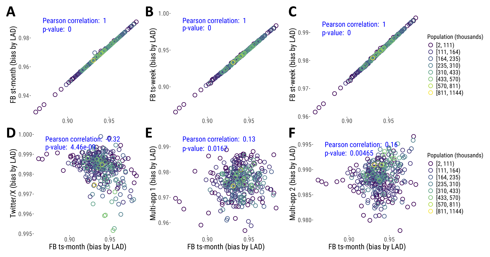

::: {.callout-note icon="false"}
The main document should include:

Title (no more than 150 characters)

Author names and affiliations, and ORCID iDs where available

Abstract (no more than 200 words). (This will be used in reviewer
invitation emails so please think about how to describe your work to
make it easy for a potential reviewer to determine whether they would be
suitable.)

All main manuscript text. Ensure that all figures, tables and any
relevant supplementary materials are mentioned within the text
References

Acknowledgements and funding statement (ensure that you have included
grant numbers and the names of any funding providers)

Tables with captions Figure captions with credits where relevant
:::

\newpage

# Alternative data aggregation approaches for Facebook data

{width="514" height="248"}

# Testing for spatial autocorrelation in the size of bias

according to multiple spatial weighting schemes --\> compute moran's I
and p-values, display them in a table (schemes as columns, data source
as rows)
